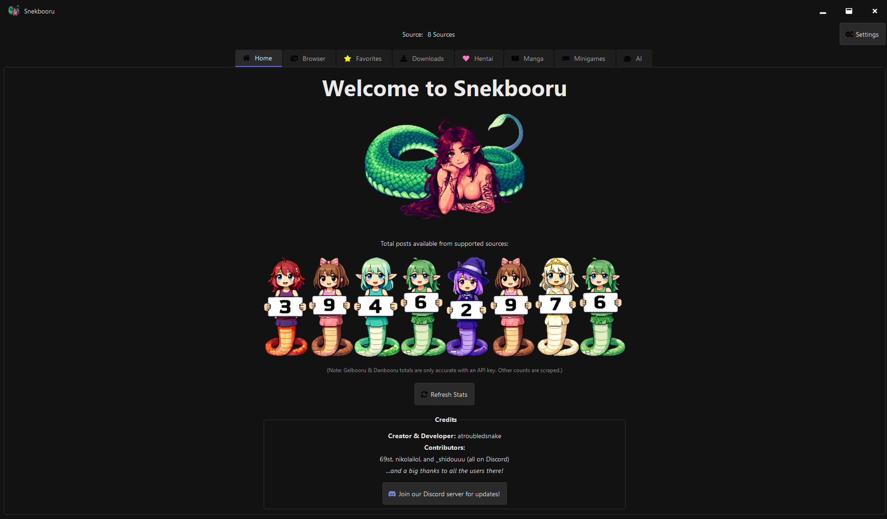
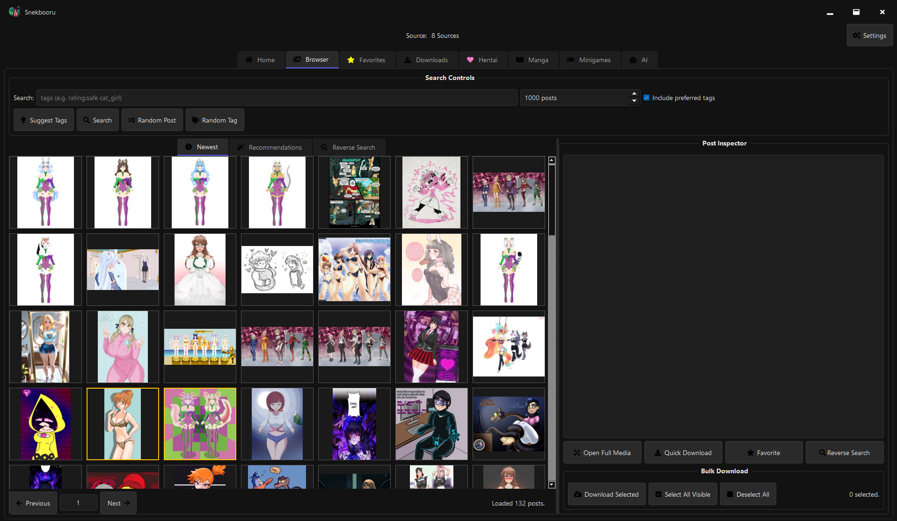
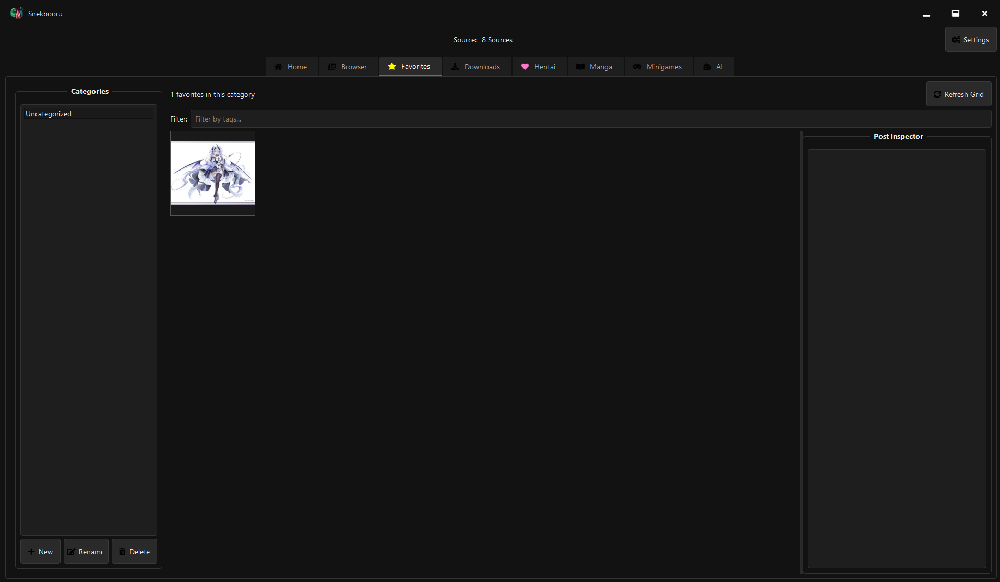
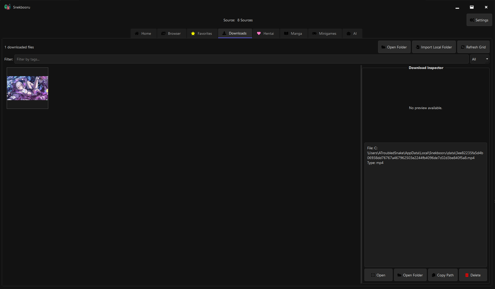
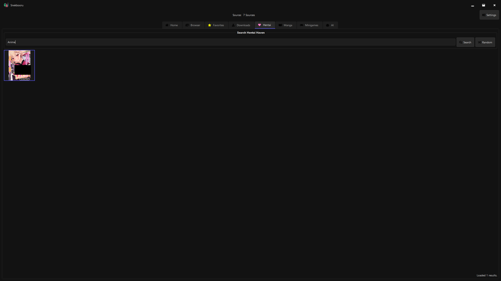
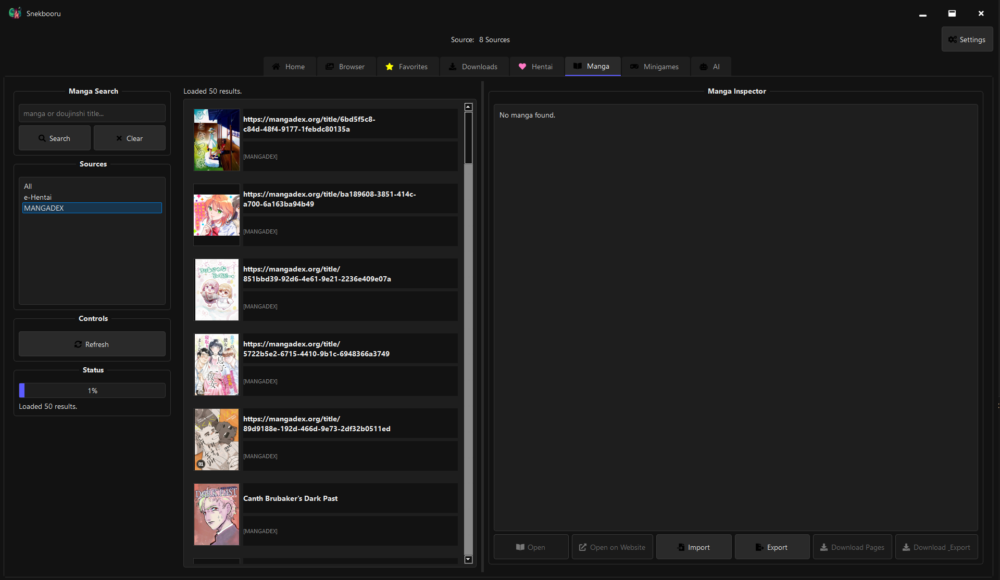
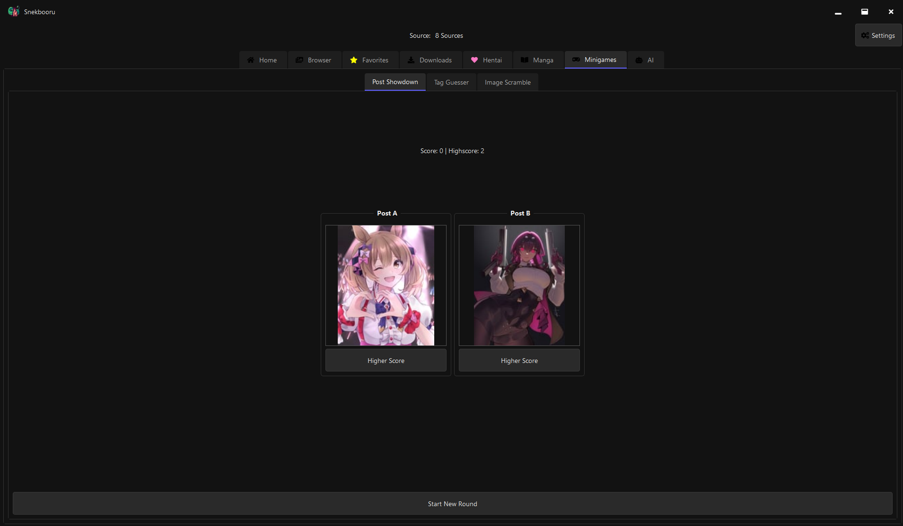
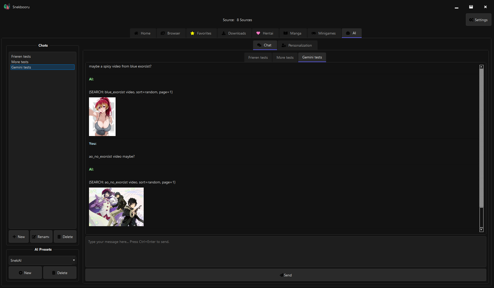

  

# IMPORTANT NOTICE
### This README is still maintained, however it is recommended
that you go to https://snekbooru.org/ for more information regarding this project. (Usually a few hours/days behind on updates however)

# Snekbooru
### Finally common sourced!
## Disclaimers
  - **THIS IS NOT A WRAPPER FOR THE PyPi PROJECT [Snakebooru](https://pypi.org/project/snakebooru)**
  - **THIS PROJECT IS COMMON SOURCE, FOR MORE INFORMATION AND INQUIERIES PLEASE CONTACT THE CREATOR AND DEVELOPER atroubledsnake**
  - **PROJECT VERSIONS 6.0.0 AND BELOW MAY CAUSE WINDOWS DEFENDER OR YOUR ANTIVIRUS TO BLOCK OUR APP DURING INSTALL OR RUNNING, THIS IS BECAUSE OF THE FACT WE DO NOT POSSES A CODE SIGNING LISCENCE AND OBFUSCATION TECHNIQUES USED TO KEEP THE SOURCE CODE SECURE**
  - **NOTE: IF YOU POSSES A VERSION FROM PRE 6.0.0 IF YOU INSTALL THE NEWEST VERSION YOU WILL HAVE TO MANUALLY REMOVE THE OLD INSTALLATION IN C:\Program Files (x86)\Snekbooru, SINCE THE NEW INSTALLER INSTALLS TO C:\Program Files\Snekbooru AND YOU WILL END UP WITH TWO INSTALLATIONS IF YOU DON'T, SORRY FOR THE INCONVENIENCE (ALTERNATIVELY YOU CAN CHANGE THE INSTALLATION PATH WITHIN THE INSTALLER ITSELF TO THE CORRECT LOCATION)**

## Showcase

  
   <i>Home Page</i>  
  
   <i>Browser</i>  
  
   <i>Favorites</i>  
  
   <i>Downloads</i>  
  
   <i>Hentai Tab</i>  
  
   <i>Manga Reader</i>  
  
   <i>Minigames</i>  
  
   <i>AI Assistant</i>  

## Features

### Content & Sources
- **Multi Source Support**: Browse content from multiple built in sources:
  - Gelbooru, Danbooru, Konachan, Yandere, Rule34, Hypnohub, Waifu.pics, Zerochan
- **Combined Search**: Search across all sources simultaneously for a massive content pool.
- **Custom Sources**: Add your own favorite booru sites to the application.

### Media & Viewing
- **SNEK Apollo**: High performance (mhm mhm, yes yes), custom multimedia framework for video playback and streaming support.
- **Modern Image Formats**: Native support for AVIF and WebP images, ensuring compatibility with all modern imageboards and some a bit less modern.
- **FullScreen Viewer**: An immersive, multiprocess media viewer with zoom and video controls that won't freeze the app.
- **Manga Reader**: A dedicated tab for searching and reading manga from various online sources, complete with an integrated ad blocker.
- **Automatic Video Support**: Plays most video formats automatically (requires VLC Media Player).

### Search & Organization
- **Tag Based Searching**: Powerful tag search with auto completion to find exactly what you're looking for.
- **Reverse Image Search**: Find the source of an image using SauceNAO, IQDB, or Google Lens.
- **Favorites System**: Save your favorite posts for easy access.
- **Personalized Recommendations**: Get content suggestions based on your favorites and search history.
- **Bulk Downloading**: Download multiple posts at once with a progress tracker.
- **Blacklist System**: Filter out unwanted content using a personal tag blacklist.
- **Search History**: Quickly access your previous searches.
- **16+ Languages**: Fully localized interface supporting English, Polish, Russian, Spanish, Japanese, Korean, and many more.
- **Customizable Theming**: Style the entire application using a simple but powerful sCSS (snek CSS) system.
- **Incognito Mode**: Browse privately without affecting your history or recommendations.

### Fun & Games
- **Random Post/Tag**: Discover new content and tags with the click of a button.
- **Tag Suggestion System**: Get ideas for new tags to explore.
- **Multiple Minigames**: Test your knowledge and have fun with several built in games:
  - Post Showdown, Tag Guesser and Image Scramble!!

## Download
Windows precompilation only for now
- Link: [WIN_Snekbooru_Installer_x64](https://github.com/The-SNEK-Initiative/Snekbooru/releases/download/v6.0.1/WIN_Snekbooru_Installer_x64.exe)

## Installation

1. Run the Snekbooru installer (WIN_Snekbooru_Installer_x64.exe)
2. Follow the Iluvatar installation wizard
3. Launch Snekbooru from your Start Menu or desktop shortcut

### System Requirements

- Windows 7 or later (64-bit)
- 4GB RAM recommended
- VLC Media Player 64-bit (required for video playback)
- Internet connection

## First-Time Setup

1. On first launch, you'll be prompted to configure your settings.
2. **(Optional but Recommended)** Enter API keys for enhanced access:
   - Gelbooru: User ID and API Key
   - Danbooru: Login and API Key
   - Rule34: User ID and API Key
   - AI Chat: OpenRouter.ai API Key (free)

### Getting API Keys

- **Gelbooru**: Available with a [Gelbooru account](https://gelbooru.com/index.php?page=account&s=reg).
- **Danbooru**: Available with a [Danbooru account](https://danbooru.donmai.us/users/new).
- **Rule34**: Available with a [Rule34 account](https://www.google.com/url?sa=t&rct=j&q=&esrc=s&source=web&cd=&ved=2ahUKEwiBnqiH1KuPAxUrEhAIHQ4mIeoQFnoECAoQAQ&url=https%3A%2F%2Frule34.xxx%2Findex.php%3Fpage%3Daccount%26s%3Dreg&usg=AOvVaw3TBT0l81tteZ1h8o6JIaHA&opi=89978449).
- **AI Chat (OpenRouter)**: Get a free key from [OpenRouter.ai](https://openrouter.ai/), a gateway for various AI models.
- **AI Chat (Google DeepMind Gemini)**: Free key available with a [Google DeepMind account](https://ai.google.dev/gemini-api/docs).

The application works without API keys but may have reduced functionality or be subject to stricter rate limits.

## Basic Usage

### Searching
1. Select your preferred source from the sources tab in Settings.
2. Enter tags in the search box (e.g., "cat_ears rating:safe").
3. Click "Search" or press Enter.

### Downloading
- **Single File**: Click a thumbnail, then use the "Quick Download" button in the Post Inspector.
- **Bulk Download**: Ctrl/Shift+Click thumbnails to select them, then use the "Download Selected" button.

### Favorites
- Add/remove favorites via the star button in the Post Inspector or by right clicking a thumbnail.
- View all your favorites in the "Favorites" tab.
- Recommendations in the "Browser" tab improve based on your favorites and history.

### Reverse Image Search
1. Go to the "Browser" tab, then the "Reverse Search" subtab.
2. Drag and drop an image, paste an image from your clipboard, or upload a file. You can also paste an image URL.
3. Select a search engine (SauceNAO, IQDB, Google Lens).
4. Click "Search".

## Advanced Usage

### AI Chat
The AI tab provides a sophisticated chat interface with advanced capabilities.
- **Multi Chat**: Maintain multiple independent conversations with the AI.
- **Tool Integration**: The AI can now perform tasks for you, such as searching for images or inspecting specific posts.
- **Presets**: Switch between different AI models (OpenRouter, Gemini) and personas using the Presets menu.
- **Setup**: Go to `Settings -> AI API` to enter your OpenRouter and/or Gemini API keys.
- **Personalization**: Adjust creativity, tone, and verbosity sliders to fine tune the AI's responses.

### Customizing Appearance
Snekbooru uses a custom styling language called sCSS (snek CSS not sassy CSS) to give you full control over the application's look and feel.
1. Go to `Settings -> Appearance`.
2. Click "New" to create a new theme file. It will open in the built in sCSS editor, pre filled with an example.
3. Click "Styling Help" for a detailed guide on all available selectors and properties. (This also exists on the [website](https://www.snekbooru.org/theme-guide))
4. Save your changes, then select your new theme from the "Active Theme" dropdown.

### Adding Custom Sources
You can add other booru style websites to the application.
1. Go to `Settings -> Custom Sources`.
2. Click "New" to open the Booru Editor.
3. Use the "Simple" mode for common booru types (Gelbooru, Danbooru, Rule34) by just providing a name and URL.
4. Use the "Advanced" mode for full control over API endpoints for unsupported site types.
5. Test your configuration before saving. Your new source will appear in the sources tab in Settings.

## Troubleshooting

### Performance Tips
- Reduce the number of grid columns for slower connections
- Lower the thumbnail size if loading is slow
- Clear search history periodically for better performance

### Common Issues

1. **"Failed to load" on thumbnails**
   - Check your internet connection
   - The post might have been deleted from the source.
   - Try refreshing the page
   - A API may have changed since I published the last version and broken something in the app, its bullshit but just wait till I patch it.

2. **API Errors**
   - Verify your API keys in Settings.
   - You might be rate limited; wait a few minutes and try again.
   - Check if the source website is online

3. **Download Issues**
   - Ensure you have write permissions to the download folder
   - Check available disk space
   - Try changing the download location in Settings

4. **Languages not loading properly everywhere**
   - This is a known issue, the only fix right now is to restart the application.

## Support

For bug reports, feature requests, and community discussion, please join our Discord server or contact the developers.
- **Discord**: https://discord.gg/BqNxn7ftqn
- Creator: atroubledsnake
- Contributors: 69st (Discord), _shidouuu (Discord)

### Releases moved indefinetly to RELEASES.md and website https://www.snekbooru.org/

## Credits

- Creator & Developer: atroubledsnake
- Developers: meowaste and rxnd0m_dev (Thank them for the CS version!)
- Testers & Idea Contributors: 69st, _shidouuu and nikolailol

Special thanks to all users who provided feedback and suggestions!